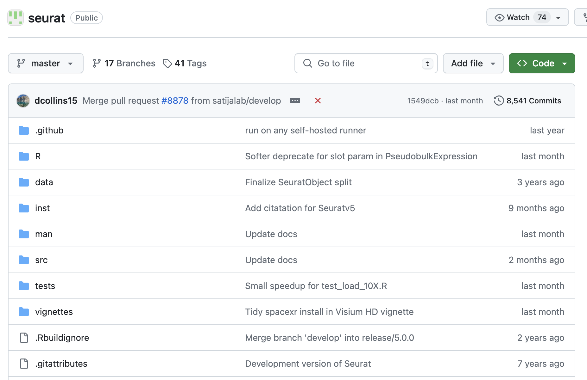

# Structuring a project

Before starting any new coding project, taking some time to appropriately structure your coding environment **WILL** save you headaches in the future!

Let's work through **four** concrete aspects of structuring your project:

1. Version control
2. Folder/Directory Structure
3. Tracking dependencies
4. Workflow management

IMPORTANT: There are **MAAANY** different ways to structure your project. For example, [workflowr](https://github.com/workflowr/workflowr) is a framework developed at UChicago. It combines git (version control), with its own enforced directory structure to keep the user's R analysis project organized. There are literally dozens of different software available for each aspect of structuring your project. Choosing and learning the ones you like is part of the journey.

The goal here is not to pidgeon-hole you into using a specific prebuilt framework. Instead, I will encourage you all to structure things **yourself**. This will develop good organizational habits, and if done correctly will make it **trivial** to port your code to frameworks like workflowr, snakemake, etc. when the time is right. 

## Setting up a github repo for version control

Version control is extremely important. It will let you create backups of your code, keep track of progress over time, give others trust in the reproducibility of your code, and much more. 

Git is a widely used open-source version control software. Almost all major open-source projects are hosted on github, a website which provides a nice interface to git repositories. Git itself can be a little bit cumbersome and confusing. If you really want to be an expert, I recommend reading [git book](https://git-scm.com/book/en/v2). Because the hackathon code is hosted on github, we will be using git/github here. 

### How to create a "fork" of this repository

Documentation on "forking" can be found [here](https://docs.github.com/en/pull-requests/collaborating-with-pull-requests/working-with-forks/about-forks). The nice thing about forking is that you get your own "version" of this repository. You can make changes freely in that version without altering the original, and when the time is right the original repository can be updated with your changes.

### Basic git/Github tutorial

Here is a quick tutorial on how to commit your changes and push to github:

1.) Stage your changes:

<code> git add /path_to_file_to_be_staged/file_you_changed.file </code>

Note: You can check which files are currently stages with:

<code> git status </code>

2.) Commit all staged changes:

<code> git commit -m "Your commit message" </code>

3.) Push changes from local machine to Github:

<code> git push </code>

You can also pull changes from github that others have pushed:

<code> git pull </code>

Make sure to make your code commits regularly, and push to github so they will be safe in the cloud! 

## Setting up a directory structure appropriate for your project

Before you start writing code, ask yourself: what kind of project do you expect it to be? For example, if you are planning on eventually creating an R package to be hosted on CRAN ("Comprehensive R Archive Network”) then there may be some rules you need to obey. One helpful idea is to just look up the code from an existing R package you wish to emulate. Here is an example from the single-cell analysis software Seurat:

   

Likewise, you can always look up the analysis code from other published papers in your discipline for inspiration. Ask more experienced programmers for their advice. Doing these things will pay off in the long run. My recommendation is to **not** reinvent the wheel if you can help it. 

## Tracking dependencies

Personally I find this the most difficult part of structuring a project. The idea is to keep track of all the required packages, libraries, programming languages, etc. needed to be able to reproducibly run your code. Unfortunately, it only takes the wrong version of a single package to "ruin" your ability to run the code on a different machine. For this reason, a variety of solutions exist for keeping meticulous track of project dependencies. From virtual environments, containers, automation engines, etc. the list goes on.

For now, just keep your build instructions in a text file if you aren't already familiar with existing frameworks.

## Workflow management

In the biological sciences, most of you have probably heard of a workflow management framework called [Snakemake](https://snakemake.github.io/). Snakemake let's you create reproducible, automated pipelines and provides a laundry list of helpful features. The only stipulation is that it requires you to specify your pipeline following Snakemake's guidelines which, while not overly complicated, do take some time to get accustomed to. For R users, Snakemake also uses python-like syntax, providing an additional barrier to rapid adoption. 

FYI: There is a [whole world of other workflow management frameworks](https://github.com/meirwah/awesome-workflow-engines).

While these workflow management frameworks are great, it is **not required** that you immediately adopt your project to a specific one. I will show a very basic strategy which can let you hit the ground running, while also making later adoption to a workflow management framework a breeze. **I highly recommend using a workflow management framework once you are ready to run at scale or publish to a wide audience!**

### Very basic workflow management step 1: Create a config file template for your project

A config file is just a central place where you can specify modifiable parameters for your pipeline. Every time you run your pipeline, you can create a new config file from the template and just change whatever parameters are unique for that run. This also makes it easier to keep track 

### Very basic workflow management step 2: Keep your scripts general

This one is simple, but in practice is rarely adhered to. The idea is to not have **any** hardcoded values/variables in your scripts themselves. Ideally, your scripts should only need one direct input: the path to the appropriate config file. From there, it can read variables as specified in the config file. **Do not hardcode variables within the script!** 

### Very basic workflow management step 3: Split your scripts into steps, and number them

Having all your code in one long script is, unsurprisingly, an unstable solution. Ideally, you want the code split into discrete steps which make sense, and code organized to reduce redundancy. For example, if you have commonly used functions among all your scripts, you should put them in their own files to be imported when needed. 

If the scripts are meant to be run sequentially, then simply number them. You will thank yourself later as your project starts to balloon.

Also, consider making a workflow diagram as an additional organizational aid. I like this one from [Genpipes](https://bitbucket.org/mugqic/genpipes/src/master/resources/workflows/GenPipes_rnaseq_stringtie.png) for inspiration:

   

## Examples

[Good project](https://github.com/SaideepGona/2024_T32_GME_Annual_Hackathon/tree/main/tutorials/structuring_a_project/example_projects/good_python)

   

[Bad Project](https://github.com/SaideepGona/2024_T32_GME_Annual_Hackathon/tree/main/tutorials/structuring_a_project/example_projects/bad_python)
